# Installation et Configuration d'une VM Debian Client (`userdebian`)

**Auteur :** Thibaut HUET  
**Date :** Octobre 2026  
**Contexte :** Projet AP BTS SIO — Infrastructure RedOne / GSB  

---

## Table des matières

1. [Introduction](#1-introduction)
2. [Récapitulatif des Identifiants et Mots de Passe](#2-récapitulatif-des-identifiants-et-mots-de-passe)
3. [Configuration et Spécifications de la VM](#3-configuration-et-spécifications-de-la-vm)
4. [Guide d'installation étape par étape](#4-guide-dinstallation-étape-par-étape)
   - [Étape 1 : Démarrage du programme d'installation](#étape-1--démarrage-du-programme-dinstallation)
   - [Étape 2 : Configuration du Nom de Machine (Hostname)](#étape-2--configuration-du-nom-de-machine-hostname)
   - [Étape 3 : Configuration du Domaine Réseau](#étape-3--configuration-du-domaine-réseau)
   - [Étape 4 : Définition du mot de passe Superutilisateur (root)](#étape-4--définition-du-mot-de-passe-superutilisateur-root)
   - [Étape 5 : Création du compte utilisateur standard](#étape-5--création-du-compte-utilisateur-standard)
   - [Étape 6 : Définition du mot de passe utilisateur](#étape-6--définition-du-mot-de-passe-utilisateur)
   - [Étape 7 : Choix de la méthode de partitionnement](#étape-7--choix-de-la-méthode-de-partitionnement)
   - [Étape 8 : Sélection du schéma de partitionnement](#étape-8--sélection-du-schéma-de-partitionnement)
   - [Étape 9 : Confirmation de l'écriture des partitions sur le disque](#étape-9--confirmation-de-lécriture-des-partitions-sur-le-disque)
   - [Étape 10 : Analyse des supports d'installation complémentaires](#étape-10--analyse-des-supports-dinstallation-complémentaires)
   - [Étape 11 : Sélection du miroir de paquetage APT](#étape-11--sélection-du-miroir-de-paquetage-apt)
   - [Étape 12 : Configuration du serveur mandataire (Proxy HTTP)](#étape-12--configuration-du-serveur-mandataire-proxy-http)
   - [Étape 13 : Sélection des logiciels à installer (Desktop GNOME & SSH)](#étape-13--sélection-des-logiciels-à-installer-desktop-gnome--ssh)
   - [Étape 14 : Confirmation du chargement d'amorce GRUB](#étape-14--confirmation-du-chargement-damorce-grub)
   - [Étape 15 : Choix du disque pour l'installation de GRUB](#étape-15--choix-du-disque-pour-linstallation-de-grub)
5. [Conclusion](#5-conclusion)

---

## 1. Introduction

Ce document détaille la procédure pas à pas pour l'installation d'une machine virtuelle Linux **Debian 13 (Trixie)** dédiée au poste client utilisateur (`userdebian`) au sein du réseau d'entreprise **RedOne**.

### Objectifs
- Déployer un système d'exploitation client Linux stable et sécurisé.
- Configurer les paramètres réseau initiaux (nom de machine et domaine).
- Configurer le compte superutilisateur `root` ainsi qu'un utilisateur standard `debianuser`.
- Installer l'environnement graphique **GNOME** et le service **SSH**.

---

## 2. Récapitulatif des Identifiants et Mots de Passe

> [!IMPORTANT]
> Les identifiants et mots de passe ci-dessous ont été définis lors du processus d'installation (visibles dans les captures d'écran) :

| Compte / Paramètre | Identifiant (Username) | Mot de passe (Password) | Description |
|---|---|---|---|
| **Superutilisateur** | `root` | `debianuser` | Compte avec privilèges d'administration système complets |
| **Utilisateur standard** | `debianuser` | `debianuser` | Compte utilisateur principal pour la session graphique |
| **Nom de machine (Hostname)** | `userdebian` | - | Identifiant de la machine sur le réseau |
| **Domaine réseau** | `redone.local` | - | Domaine DNS local de l'infrastructure |

---

## 3. Configuration et Spécifications de la VM

| Paramètre | Valeur / Option sélectionnée |
|---|---|
| **Distribution / OS** | Debian GNU/Linux 13 (Trixie) - netinst (amd64) |
| **Mode d'installation** | Graphical install |
| **Disque dur virtuel** | SCSI 42.9 GB (QEMU HARDDISK) |
| **Partitionnement** | Assisté - tout dans une seule partition (ext4 + swap) |
| **Environnement graphique** | GNOME |
| **Services additionnels** | Serveur SSH, Utilitaires usuels du système |
| **Chargeur de démarrage** | GRUB sur `/dev/sda` |

---

## 4. Guide d'installation étape par étape

### Étape 1 : Démarrage du programme d'installation

Démarrer la VM sur l'image ISO de Debian 13. Au menu d'amorçage BIOS/UEFI, sélectionner **Graphical install** pour bénéficier de l'assistant d'installation graphique.

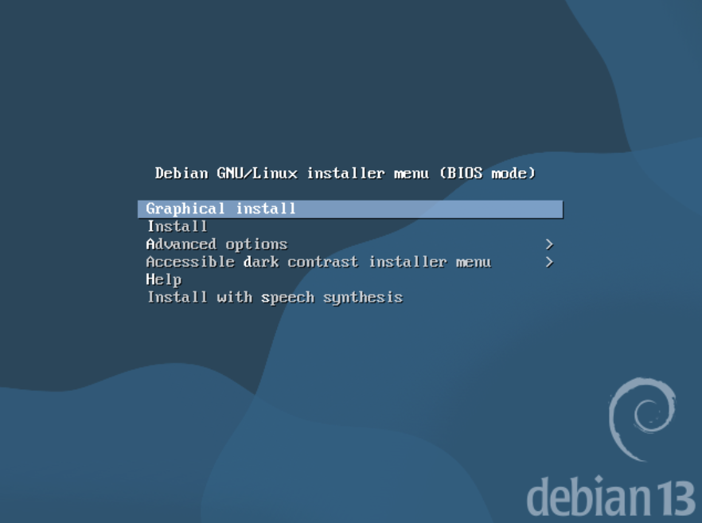

---

### Étape 2 : Configuration du Nom de Machine (Hostname)

Indiquer le nom unique de la machine sur le réseau :
- **Nom de machine :** `userdebian`

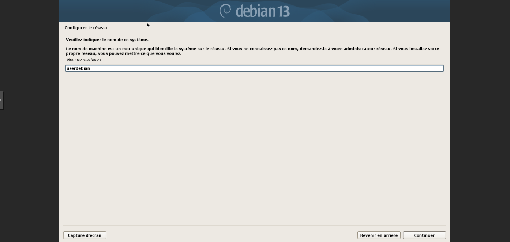

---

### Étape 3 : Configuration du Domaine Réseau

Indiquer le nom de domaine de l'infrastructure d'entreprise :
- **Domaine :** `redone.local`

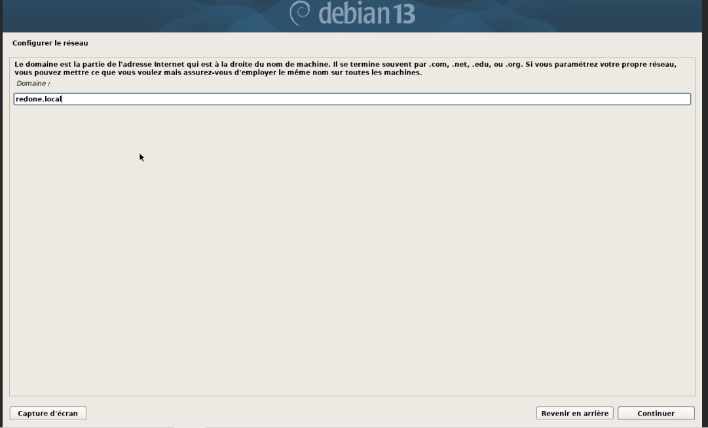

---

### Étape 4 : Définition du mot de passe Superutilisateur (root)

Paramétrer le mot de passe d'administration du compte `root` :
- **Mot de passe root :** `debianuser`
- **Confirmation :** `debianuser`

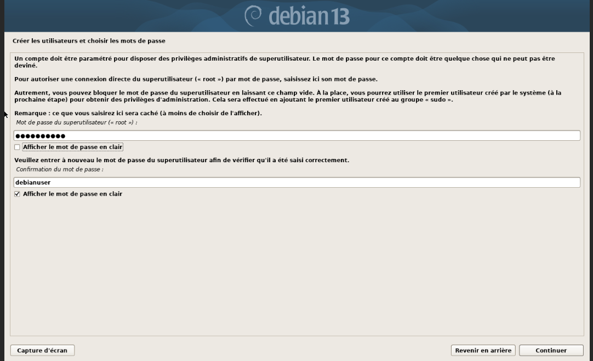

---

### Étape 5 : Création du compte utilisateur standard

Saisir le nom complet pour l'utilisateur courant du système :
- **Nom complet du nouvel utilisateur :** `debianuser`

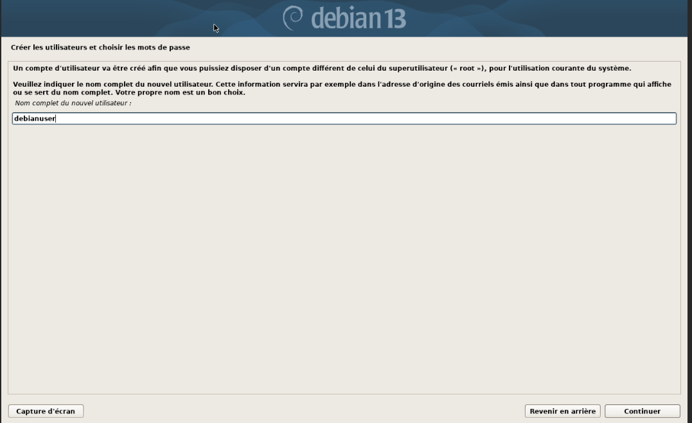

---

### Étape 6 : Définition du mot de passe utilisateur

Saisir et confirmer le mot de passe pour le compte utilisateur `debianuser` :
- **Identifiant :** `debianuser`
- **Mot de passe :** `debianuser`
- **Confirmation :** `debianuser`

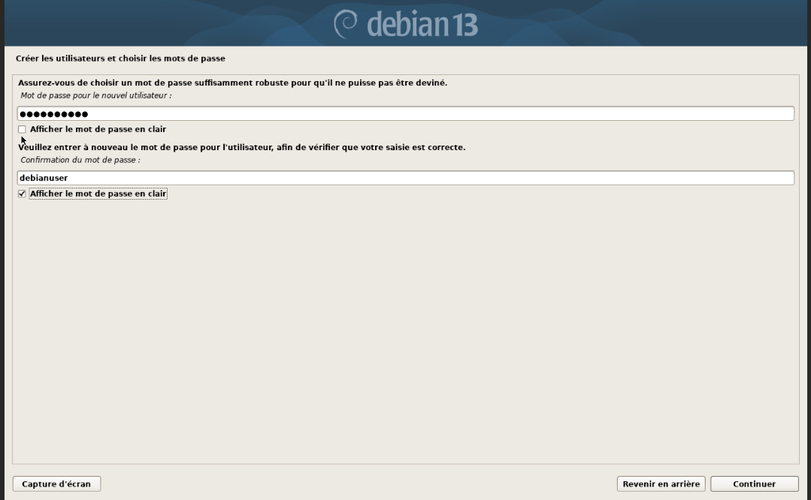

---

### Étape 7 : Choix de la méthode de partitionnement

Pour la préparation du disque dur, choisir le partitionnement automatique assisté :
- **Méthode :** `Assisté - utiliser un disque entier`

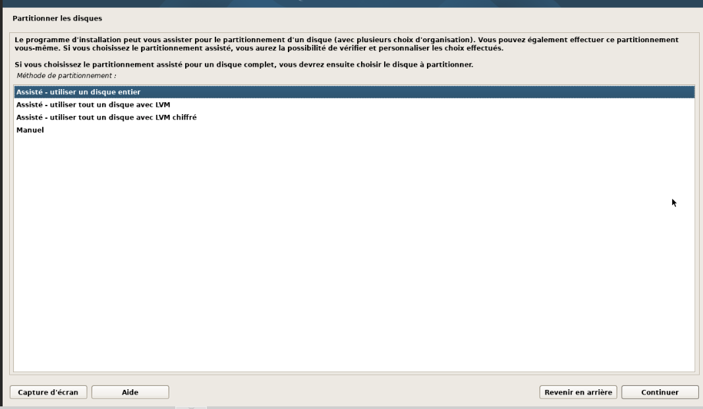

---

### Étape 8 : Sélection du schéma de partitionnement

Sélectionner le disque dur SCSI (QEMU 42.9 GB) et opter pour la structure classique :
- **Schéma de partitionnement :** `Tout dans une seule partition (recommandé pour les débutants)`

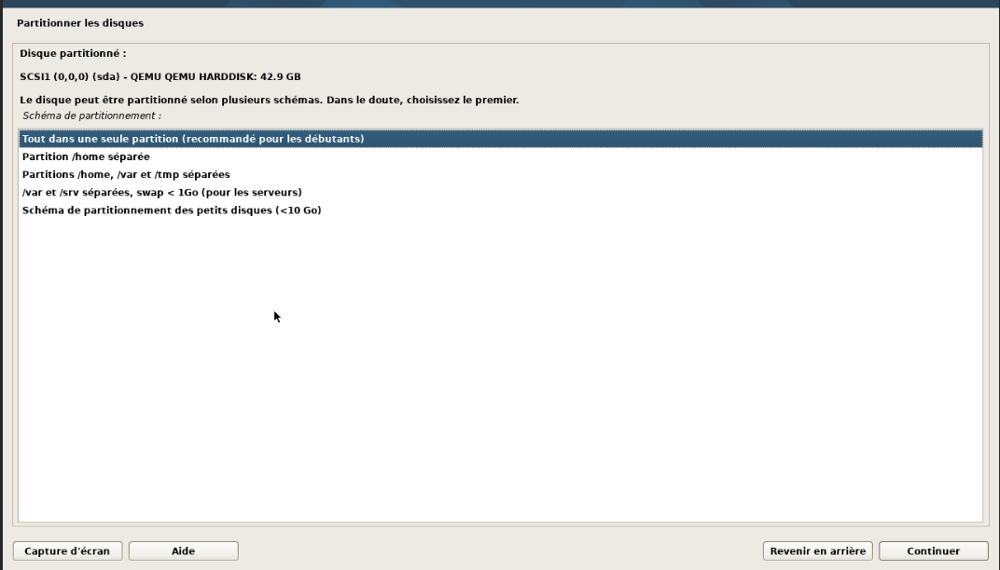

---

### Étape 9 : Confirmation de l'écriture des partitions sur le disque

Valider la création des partitions (`partition n°1 ext4` pour le système et `partition n°5 swap` pour le fichier d'échange) :
- **Faut-il appliquer les changements sur les disques ?** `Oui`

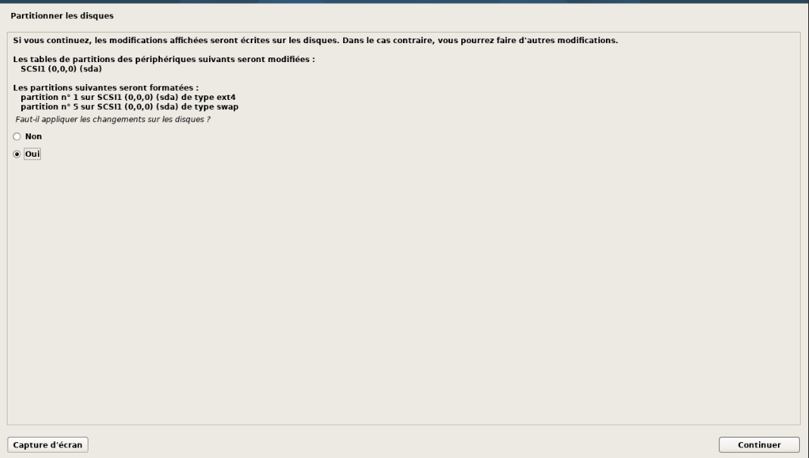

---

### Étape 10 : Analyse des supports d'installation complémentaires

Le programme d'installation détecte l'ISO NETINST (`Debian GNU/Linux 13.3.0 _Trixie_`). Ne pas ajouter d'autres médias d'installation :
- **Faut-il analyser d'autres supports d'installation ?** `Non`

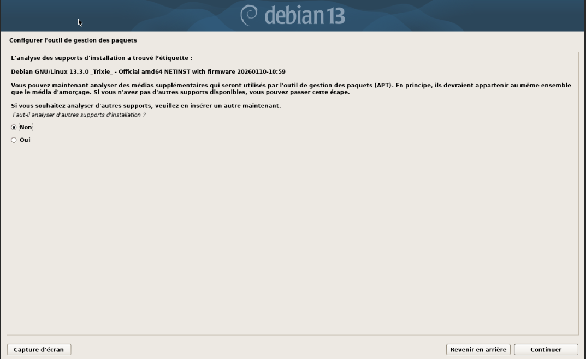

---

### Étape 11 : Sélection du miroir de paquetage APT

Pour télécharger les paquets logiciels complémentaires via Internet, choisir le miroir par défaut :
- **Miroir de l'archive Debian :** `deb.debian.org`

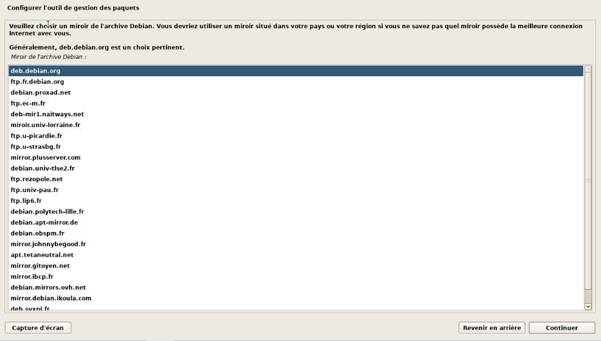

---

### Étape 12 : Configuration du serveur mandataire (Proxy HTTP)

Aucun serveur mandataire n'est requis dans cet environnement :
- **Mandataire HTTP :** *(Laisser vide)*

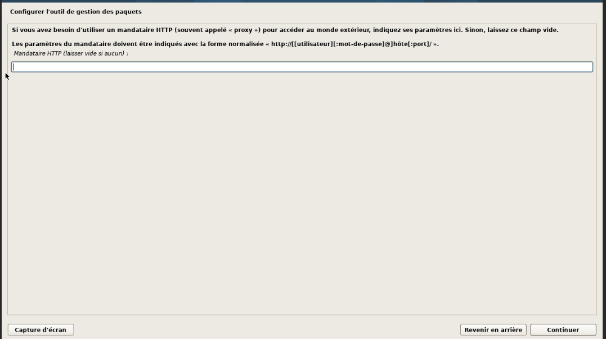

---

### Étape 13 : Sélection des logiciels à installer (Desktop GNOME & SSH)

Cocher les ensembles de logiciels requis pour le poste de travail et la gestion à distance :
- [x] **environnement de bureau Debian**
- [x] **... GNOME**
- [x] **serveur SSH**
- [x] **utilitaires usuels du système**

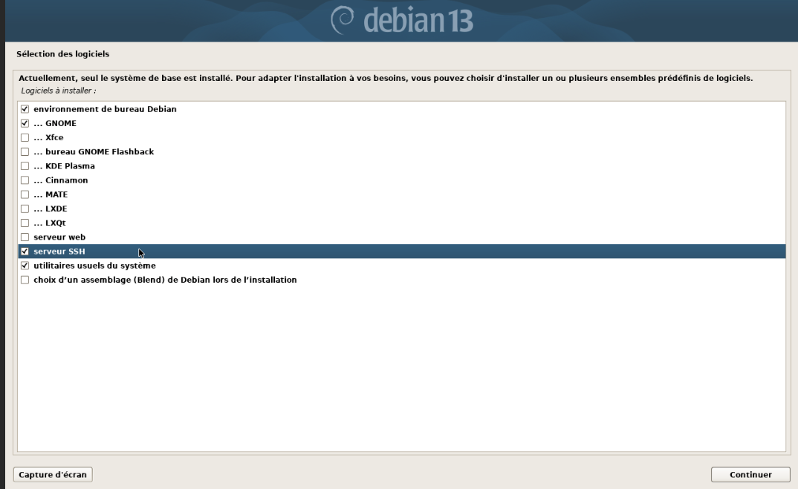

---

### Étape 14 : Confirmation du chargement d'amorce GRUB

Autoriser l'installation du programme de démarrage GRUB sur le disque principal :
- **Installer le programme de démarrage GRUB sur le disque principal ?** `Oui`

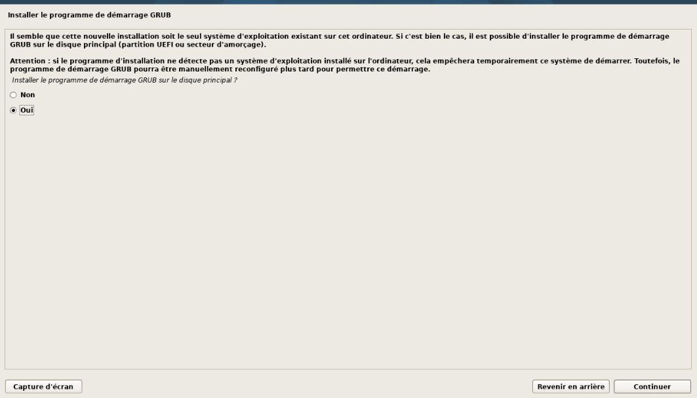

---

### Étape 15 : Choix du disque pour l'installation de GRUB

Sélectionner explicitement le disque dur d'amorce :
- **Périphérique :** `/dev/sda (scsi-0QEMU_QEMU_HARDDISK_drive-scsi0)`

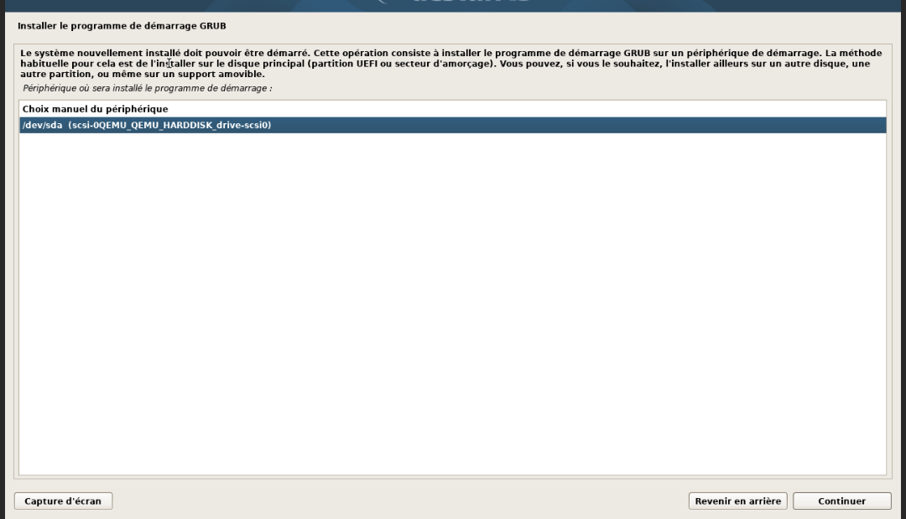

---

## 5. Conclusion

L'installation de la machine virtuelle `userdebian` est finalisée. La VM redémarrera directement sur l'environnement graphique GNOME avec l'accès SSH activé. Les identifiants créés (`root` / `debianuser` avec le mot de passe `debianuser`) permettent de prendre la main immédiatement sur le système pour la suite du TP.
